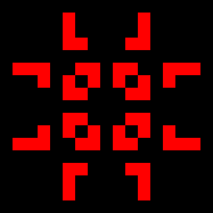

# Game of Life

[Conway's Game of Life](https://en.wikipedia.org/wiki/Conway%27s_Game_of_Life), also known simply as Life, is a cellular automaton made by the British mathematician John Horton Conway in 1970.

## Installation

### Dependencies
 - [SDL2](https://libsdl.org/download-2.0.php)

Also you need a c++11 compatible compiler.

### Setup

```bash
git clone https://github.com/bitt4/gol
cd gol
make
./gol
```

## Usage

### Options

Running `gol` with no options will generate random grid.

Use `gol FILE` to load initial layout of game of life from file.
```bash
$ cat glider.grid # for example
000000
000100
010100
001100
000000
000000
$ ./gol glider.grid
```

| Option                |Effect                                                  |Default value|
|-----------------------|--------------------------------------------------------|-------------|
|`-w`, `--width=NUM`    |Set width of the grid in cells                          |128          |
|`-h`, `--height=NUM`   |Set height of the grid in cells                         |128          |
|`-c`, `--cell-size=NUM`|Size of cell in pixels                                  |5            |
|`-s`, `--seed=[NUM]`   |Set seed for rng, return generated seed if not specified|current time |
|`-v`, `--speed=NUM`    |Grid update frequency                                   |1            |
|`-H`, `--help`         |Display help                                            |             |

### Key bindings

| Key                            |  Description   |
|--------------------------------|----------------|
| <kbd>SPACE</kbd>               | Toggle pause   |
| <kbd>+</kbd>,<kbd>=</kbd>      | Increase speed |
| <kbd>-</kbd>                   | Decrease speed |

### Grid files
You can specify initial layout of game of life with files:
 - '0' or ' ' specify dead cells, other characters specify living cells
 - The longest line in the grid file sets width of the grid
 - Number of lines in the grid file sets height of the grid, but trailing newline at the end of file is ignored
 - Width and height specified by command-line options are overriden by width and height extracted from the grid file

## Example
Example of Pulsar oscillator pattern:

```bash
# pulsar.grid file
00000000000000000
00000000000000000
00001110001110000
00000000000000000
00100001010000100
00100001010000100
00100001010000100
00001110001110000
00000000000000000
00001110001110000
00100001010000100
00100001010000100
00100001010000100
00000000000000000
00001110001110000
00000000000000000
00000000000000000
```